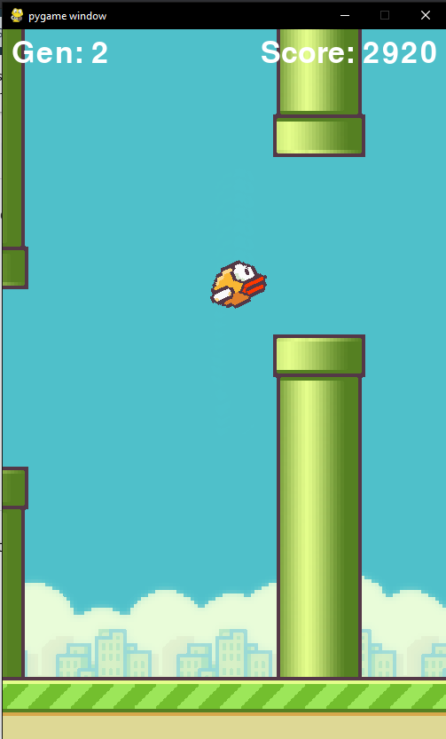

# flappy_bird
## AI that plays Flappy Bird 

* Used Python, PyGame and NEAT-Python to create AI that learns to play flappy bird
* Implemented the game environment using the PyGame module
* Used the Neuroevolution of Augmenting Topologies (NEAT) module to create a neural network clones of birds with different weightings, and filtered them using natural selection
* Based on the tutorial by Tech with Tim

## Instructions
 * Click the button below to open the project in GitPod
 * Run flappy_bird.py
 * Sit back, relax and watch the show
 
 

